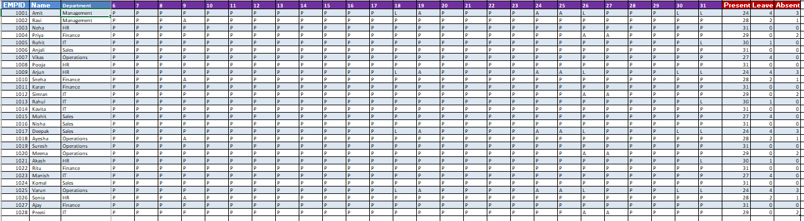
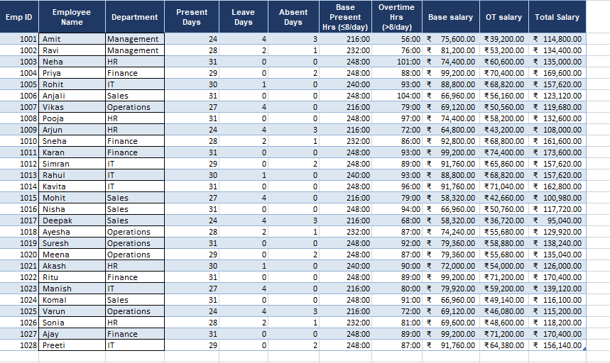

# 👥 Monthly Employee Attendance & Payroll Tracker

## 📌 Overview
A monthly attendance and payroll tracking system 
for 28 employees across 6 departments built 
entirely in Microsoft Excel.

---

## 🛠️ Tools & Skills
| Tool | Purpose |
|------|---------|
| Microsoft Excel | Main tool |
| Formulas (SUM, IF, VLOOKUP) | Calculations |
| Data Validation | P/L/A entries |
| Conditional Formatting | Color coding |
| Table Formatting | Professional layout |
| Multi-sheet Workbook | Data organization |

---

## 📂 Workbook Structure
Monthly_emp_tracker.xlsx
│
├── Pay Rate           # Department hourly & OT rates
├── Attendance Tracker # Daily P/L/A for 31 days
├── Daily Entry        # Check-in/out & hours worked
└── Monthly Summary    # Final salary calculation

---

## 👥 Departments & Pay Rates
| Department | Hourly Rate | OT Rate |
|------------|-------------|---------|
| Management | ₹350/hr | ₹700/hr |
| HR | ₹300/hr | ₹600/hr |
| Finance | ₹400/hr | ₹800/hr |
| IT | ₹370/hr | ₹740/hr |
| Sales | ₹270/hr | ₹540/hr |
| Operations | ₹320/hr | ₹640/hr |

---

## 📊 Sheet Details

### Sheet 1 — Pay Rate
- Department wise hourly rates
- Overtime rates (2x hourly rate)
- Reference table for salary calculations

### Sheet 2 — Attendance Tracker
- 28 employees tracked daily
- 31 days of attendance per month
- Status codes:
  - P = Present
  - L = Leave
  - A = Absent
- Auto count of Present/Leave/Absent days

### Sheet 3 — Daily Entry
- Employee check-in time
- Employee check-out time
- Total hours worked per day
- Overtime hours calculated automatically
- Daily attendance status

### Sheet 4 — Monthly Summary
- Total present/leave/absent days
- Base present hours (8hrs/day)
- Total overtime hours
- Base salary calculation
- OT salary calculation
- Final total salary per employee

---

## 💰 Salary Calculation Logic
- Base Salary = Present Days × 8hrs × Hourly Rate
- OT Salary = Total OT Hours × OT Rate
- Total Salary = Base Salary + OT Salary

- ---

## 💡 Key Insights

- Neha (HR) & Anjali (Sales) had perfect attendance (31/31 days)
- Finance department has highest pay rate (₹400/hr)
- Sales department has lowest pay rate (₹270/hr)
- Employees with overtime earn significantly more
- Absent days directly reduce base salary

---

## 📸 Screenshots

### Attendance Tracker

### Monthly Summary

---

## 🚀 How To Use

1. Open `Monthly_emp_tracker.xlsx`
2. Go to **Attendance Tracker** sheet
3. Enter P/L/A for each employee daily
4. Go to **Daily Entry** sheet
5. Enter check-in and check-out times
6. **Monthly Summary** updates automatically

---

## 📚 Skills Demonstrated
- Multi-sheet Excel workbook design
- Payroll calculation formulas
- Attendance tracking system
- Data validation and formatting
- Overtime calculation logic
- Department wise analysis

---

## 👤 Author
Anas Khan
Monthly Employee Tracker — 2025
Tool: Microsoft Excel

